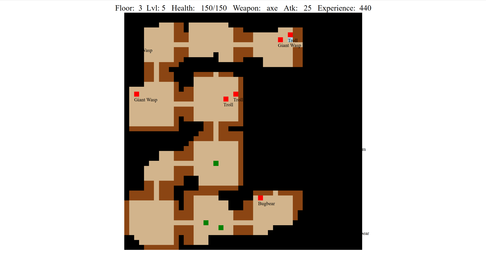

# Dungeon-Crawler
Created a dungeon crawler using react. The goal was to create a dungeon crawler without any tools other than css and javascript.
Each level is randomly generated with room objects that store their tiles, a room limit for how many objects can be in a room, and a list of possible exits based on its room position.
The coordinate system looks like room[x][y].tiles[x][y]. Once the map is generated it gets passed a number of functions generate the content and randomly place them. I wanted the lighting to be reminiscent of 
games like diablo where the map is only revealed in a radius around the player. The player can get a few weapon upgrades and defeat a boss on floor 3.  

try it on [Codepen](https://codepen.io/Cyberputty/full/XEagwd/)!
